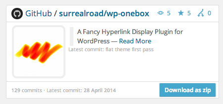
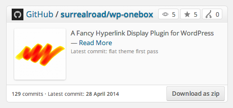
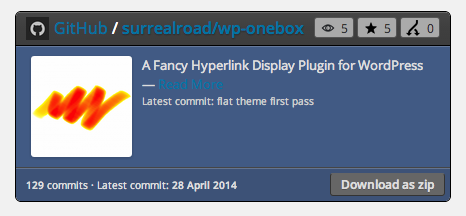
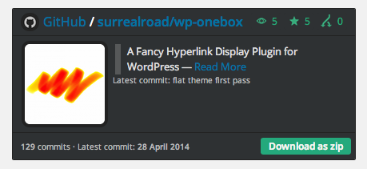
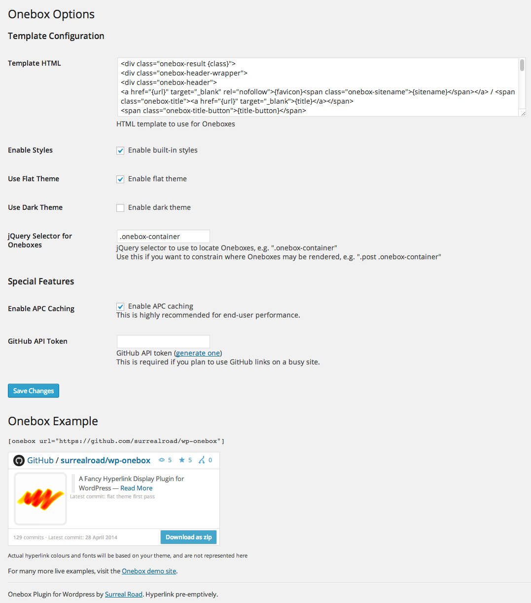

wp-onebox
==

Onebox: A Fancy Hyperlink Display Plugin for WordPress

What does this plugin do?
--
This plugin lets you use a shortcode `[onebox url="http://example.com" title="optional title" description="optional description"]` in place of a link that will display a lovely Facebook/Twitter-style box with additional information about the link.

WordPress has [built-in support](http://en.support.wordpress.com/twitter/twitter-embeds/) for some links like Google+ or Twitter, where it will generate a nice-looking embed from a link or shortcode, but what about other sites? Onebox aims to let you turn any link into an embedded box, with extra features for some special sites, and with a fully customisable HTML template.

How does the plugin work?
--
Many webpages now have metadata in their header with a desciption and image to help sites like Twitter or Facebook generate embeds. Onebox can read this same data to generate similar embeds. In addition, the plugin makes use of a number of "parsers" to scan for specific sites and pull out even more data to use.

The source is maintained on GitHub: https://github.com/surrealroad/wp-onebox

[Live demo](http://onebox.surrealroad.com)

Requirements
--
The following modules are optional, but highly recommended:
* APC extension for PHP
* GeoIP extension for PHP

Currently supported sites
--
* Any web page with Twitter metadata
* Any web page with Facebook (OpenGraph) metadata
* GitHub (github.com)
* Steam (store.steampowered.com)
* iTunes (itunes.com)*
* GOG (gog.com)*
* Mac Game Store (macgamestore.com)*
* Green Man Gaming (greenmangaming.com)*
* Origin (origin.com)*
* Lynda (lynda.com)*
* Wikipedia (wikipedia.org)
* Google Play Store (play.google.com)
* Kickstarter (kickstarter.com)
* Final Fantasy XIV: A Realm Reborn (FFXIV ARR) Database (xivdb.com)
* Ebay (ebay.com)*

others to follow

(* site uses affiliate links)

Note
--
This plugin renders affiliate links for some websites in order to support its development. You are more than welcome to fork or modify the source if you don't want to allow this.

TODO:
* Comply with WordPress security guidelines
* Add more parsers

Additional credits
* Inspired by the "Onebox" ruby gem (https://github.com/dysania/onebox)
* [Open Graph Protocol helper for PHP](https://github.com/scottmac/opengraph)
* [Amazon ECS PHP Library](https://github.com/Exeu/Amazon-ECS-PHP-Library)
* [forceutf8](https://github.com/neitanod/forceutf8)
* [html5lib - php flavour](https://github.com/html5lib/html5lib-php)
* Vanilla template based on "Facebook Notify Widget" by Pixels Daily and [GitHub-jQuery-Repo-Widget](https://github.com/JoelSutherland/GitHub-jQuery-Repo-Widget)
* Flat template based on "FlatPad" by [Repix Design](http://store.repixdesign.com/)
* [PHPQuery](https://code.google.com/p/phpquery/)
* Icons by [Symbly](http://symb.ly)
